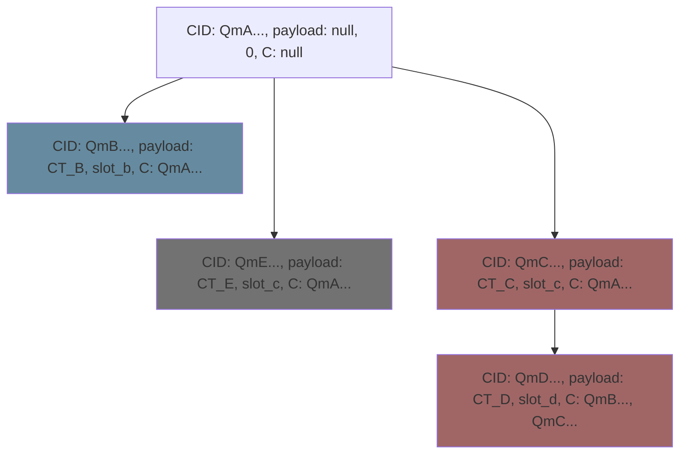

# Delayed Transactions

In this document we describe the delayed transactions implementation. In particular, we describe the timelocked transaction pool based on the concept a Merkle clocks.

Delayed transactions is a core feature of the ETF network. It allows network participants to delay transactions for future blocks while the transactions themselves are kept hidden via timelock encryption. The basis of the delayed transaction pool is the idea of a Merkle clock DAG.

## Background

### Timelock Encryption

Briefly we want to recap how the timelock encryption scheme works at a very high level. We can represent it with three algorithms:

1. $(SK, nonce) \leftarrow Setup(1^\lambda)$ which gives us a random 128-bit secret key and 12-bit nonce (for AES-GCM).
2. $(CT, capsule) \leftarrow Tlock.Enc(M, SK, nonce, t, \{ID_i\}_{i \in [n]})$ where $M \in \{0, 1\}^*$ is any message, and $(SK, nonce)$ are the output of the setup function. Each $ID_i$ is a unique slot identity and $t < n$ is some threshold of slot secrets required to recover $SK$.
3. $M \leftarrow Tlock.Dec(CT, capsule, nonce, \{sk_i\}_{i \in [n']})$ where $\{sk_i\}_{i \in [n']}$ consists of some threshold $t < n' \leq n$ secret keys leaked by the ETF consensus mechansim, without knowledge of $SK$.

When convenient, we will just use $CT$ to represent the output of the encryption function.

### Merkle Clocks

A Merkle clock DAG [1] is a Merkle DAG where each node represents an 'event' in some event space.

A Merkle-clock DAG[1] is a Merkle DAG based logical clock to represent causality information between events in a distributed system. Each node in the DAG represents an event and allows for the construction of a grow-only set of events in a distributed system. It provides a mechanism for defining a partial ordering of all events defined in the clock, and by merging with other clocks, we can produce a partial ordering of their union. Here, partial ordering means we can tell if an event `A` happened before, after, or during another event `B`. We can easily introduce total ordering to the merkle clock by including extra information related to an external clock against which the logical clock 'ticks'. Watch this youtube video from protocol labs [at the 18 minute mark](https://youtu.be/ukfrmBVrpo8?t=1078) to get a better idea of how a Merkle clock works. In general, the entire video will provide a significant amount of context beyond what we can provide in the scope of this proposal.

To be specific, each node in the DAG looks like $(CID, EVENT, C)$, where $CID$ is the CId of the event, $EVENT$ is the event payload, and $\mathcal{C}$ refers to the direct ancestors' CIDs. This allows for the construction of a partially ordered history of events, ordered based on their CIDs. By introducing a weight on each node, we can induce a total ordering of all events in the DAG.

## Timelocked Transaction Pool

The timelocked transaction pool allows network participants to share new Merkle clock nodes with each other. It serves as a way to construct a globally replicated Merkle clock where each event payload is a ciphertext, encrypted with timelock encryption.

Each event in our Merkle clock represents a timelocked call, where we define a call in the same way as [substrate](https://docs.substrate.io/reference/transaction-format/) defines a call (CALL = (EXT, DATA)). The clock node payload, or **transaction**, contains a ciphertext which is a call encrypted for some slot $sl_i$. That is, the payload is given by $CT \leftarrow TLock.Enc(tx, ID(sl_i))$.

We modify the Merkle clock node defined above so that we can include a node weight. We model this as AUX data which we can use to build a global total ordering of events in the clock. Thus, each node in our Merkle clock looks like:

$(CID_i, (CT_i, AUX), \mathcal{C}_{CID_i})$
 
 where $CT_i$ is the timelocked call, $CID_i$ is the CID of the CALL hashed together with a random number, $\mathcal{C}_{CID_i}$ are its direct descendents' CIDs, and $AUX$ refers to a [slot identity](https://etf.idealabs.network/docs/ETF-extras/architecture#slot-identity) for which the ciphertext is encrypted. That is, $AUX = ID(sl_k)$ for some slot $sl_k$.

### Create Transactions

Since we are removing the standard monotonically increasing nonce but we still want to ensure signatures are only valid on transactions when they're decrypted, we use a randomly chosen nonce instead. This provides us with the flexibility to schedule transactions at any time, no longer restricted to transactions being purely sequentially transmitted to the network.

**Transactions**

Let $P$ be some participant in the network and assume they have a keypair $(SK, PK)$. In substrate, these will likely be sr25519 keys. Let $CALL=(EXT, DATA)$ be some valid call to an extrinsic exposed by the blockchain and $k > 0$ be some future block height that will be produced in slot $sl_k$. Choose a random $r \xleftarrow{R} \mathbb{Z}_p$ (where $\mathbb{Z}_p$ is some finite field over which we are operating and $p$ is a large prime) and calculate $H = Sha256(CALL) \oplus r$ where $\oplus$ is bitwise addition (32 bits). Then, calculate the CID of $H$, $CID_H$. We use the CID of $H$ rather than the CID of the call data in order to identify the clock node. We do this for two reasons: firstly, it ensures that all CIDs in the clock DAG are unique, and secondly it re-randomizes the CID which prevents any potential adversary from succesfully guessing the preimage of the CID.

Once the CID is calculated, encrypt the CALL data using timelock encryption, $CT \leftarrow TLock.Enc(tx, ID(sl_i))$, and use the slot $sl_k$ to determine the set of ancestors $\mathcal{C}$. Transactions are only valid if every payload associated with the ancestor set has a *lower* node weight than new payloads added on top of it, otherwise we will have out-of-order transactions in the DAG. Then, prepare the Merkle clock node:

$N := (CID_H, (CT, sl_k), \mathcal{C})$

**Signatures**

We need to ensure that signatures are valid only for the specific CALL, the specific randomly chosen blinding variable $r$, and the slot $sl_k$. Transaction signatures are built by signing the CID of the clock node concatenated with the slot identity. That is, signatures are produced as:

$SIG \leftarrow Sign(SK, CID_H || ID(sl_k))$

where $||$ is concatenation.

Finally, broadcast $(N, (PK, SIG))$ to peers.

### Import Transactions

#### Transaction Validations

When a transaction is received from a peers, we first need to ensure its validity. Of course, we cannot check that the payload represents a valid call, but instead we check that:
- signatures are valid
- ancestor set is valid
- node weights are valid

If the validations pass, then the nodes can be merged into the transaction pool, or DAG. Here, we detail the validations

Let $N := (CID_H, (CT, sl_k), \mathcal{C})$ be a clock node received from some peer with public key $PK$ with signature $SIG$.

**Signature Validation**

Signatures are signed on the message $M := CID_H || ID(sl_k)$. So, when receiving a signed clock node $(N, SIG)$, we calculate $v \leftarrow Verify(SIG, M, PK)$. If $v \neq 1$, then the signature is not valid and the clock node is rejected. If $v == 1$, then we continue.

**Ancestor Set/Node Weight Validation**

Let $\mathcal{D}$ represent the transaction pool DAG and $w$ represent the weight of the node we are importing. First, we first check that for each $CID \in \mathcal{C}$ there is a corresponding node $N_{CID} \in \mathcal{D}$. If $N_{CID} \notin \mathcal{D}$ for any clock node, then the clock node is rejected. Assuming $\mathcal{C}$ contains valid CIDs, we now verify that the node weights are valid. That is, for each node $N_{CID} \in \mathcal{C}$, let $w_{CID}$ represent the node weight (i.e. AUX data). Then we check that $\forall N_{CID} \in \mathcal{D}$, $w_{CID} < w$. If valid, then the new clock node is accepted and merged into the Merkle clock DAG.

## Blocks

### Block Production

Block producers in the ETF network are primarily responsible for produce IBE secrets and DLEQ proofs. For now, we assume Aura consensus is used. In addition, block producers must read clock nodes from the DAG based on their weights. Then, after validating signatures and rejecting invalid entires, the block producer can use the freshly calculated IBE secret in order to decrypt ciphertexts and recover the original data. 

Let $k > 0$ and suppose authority $A_j$ is the authorized block producer for the slot. Then...

1. Perform the IBE extract function and prepare a DLEQ proof (ETF consensus). Let $sk_k$ represent the derived IBE secret.
2. the block producer must fetch clock nodes that are weighted for the current slot. That is, the block producer fetches clock nodes with weight $w = sl_k$. Let $N_w$ be the set of clock nodes weighted for the current slot.block producer. The block producer is free to choose any subset $T' \subseteq  T$ of the clock nodes that it wishes to process. However, since transactions are encrypted, block producers are not able to pick-and-choose transactions at will at this stage.
3. For each clock node payload $(CT_i, sl_k)$ of nodes in $T'$, decrypt the ciphertext  with $(m, sk) \leftarrow Tlock.Dec(sk_k, CT_i)$. If decryption fails, the clock node is added to a `failed` DAG. If decryption succeeds, we continue.
4. The block producer can now pick-and-choose which transactions and in which order it wants to include in the block in order to maximize its returns. Any un-executed transactions are added to the failed transactions DAG. Each transaction is encoded in the block alongside the secret key calculated by the tlock decryption function.
5. Finally, continue to perform standard validations, ensure fee payments, etc., then build a block with the transactions and sign as usual.
6. Broadcast the signed block.
7. The block producer prunes its timelocked tx pool.

### Block Import

When receiving a block from a peer, we verify the signature and DLEQ proof in the header, as usual. However, now block importers have the additional task of checking that each of the transactions included in the block were indeed in the timelocked tx pool.

1. Verify the DLEQ proof and signature in the header
2. Verify the CIDs of each transaction exist in the timelocked tx DAG by reencrypting each one with the secret key associated with the transaction (in the block only). If any CID cannot be confirmed, the block is rejected.
3. If all is good, then accept the block and prune the transactions. Any transaction not included in the block but scheduled for the slot is added to the failed transactions list. 

Note on the failed tx list: This list is maintained locally by each node and is not gossiped or synced through the network. Each node can prune this list or delete it entirely.

## Resources

[1] Merkle-CRDTs: Merkle-DAGs meet CRDTs
Hector Sanjuan, Samuli Poyhtari, Pedro Teixeira, and Ioannis Psaras,
https://research.protocol.ai/publications/merkle-crdts-merkle-dags-meet-crdts/psaras2020.pdf

