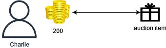

# Getting Started

The **timelock auction** is a proof-of-concept of our timelock encryption library. It uses timelock encryption to seal bids in a second-price sealed bid auction for ERC721 tokens. In this style of auction, the highest bidder only pays the amount bid by the second highest bidder, like in the image below:

## Try the auction!

1. Read the deep dive into how the auction works [here](./deep_dive.md)
2. Setup the polkadotjs extension for your browser [here](https://www.google.com/url?sa=t&rct=j&q=&esrc=s&source=web&cd=&cad=rja&uact=8&ved=2ahUKEwiLvfjlssuCAxVokmoFHcIEDc0QFnoECBgQAQ&url=https%3A%2F%2Fpolkadot.js.org%2Fextension%2F&usg=AOvVaw2JOo-8eQtOZKeKAh6dnCTU&opi=89978449) and create a new address. 
3. Head to the [discord faucet channel](https://discord.gg/Txew8BzAfb) and get some tokens by sending a message `@etf-faucet-bot !drip <your address>`
4. Go to https://auction.idealabs.network, connect your account, and you're ready to go!

