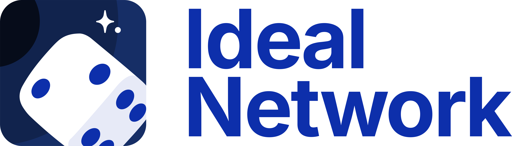

#  What time is it?

The Ideal Network (IDN) is a cross-chain **entropy** and **coordination** layer that enables on-chain verifiable randomness and timelock encryption. It introduces cryptographically enforced fairness, timelock encryption, and on-demand randomness delivery into Web3 ecosystems, beginning with Polkadot. 

## Overview

Many blockchain protocols depend on secure randomness for critical functions such as leader election, validator shuffling, bid sequencing, and cross-chain coordination. However, current randomness solutions are often either centralized, expensive, or context-bound and difficult to integrate across chains, limiting the trustworthiness and composability of decentralized applications.

Further, blockchains lack native mechanisms to **delay information disclosure** or **coordinate time-sensitive events** across chains in the absence of centralized relayers. Without the ability to securely reveal secrets only in the future, developers face challenges building fair auctions, games, and economic systems that are resistant to frontrunning, Miner Extractable Value (MEV), and early leakage. These limitations create a significant barrier to innovation in decentralized protocols requiring unbiased randomness and precise time coordination.

The Ideal Network (IDN) solves this by providing two core capabilities:

1. **Verifiable randomness**, delivered trustlessly via XCM
2. **Timelock encryption**, enabling "encryption to the future"

### Key Features

- **Verifiable Randomness-as-a-Service (VRaaS)**: The output of each beacon is *publicly* verifiable, allowing for cost-effective and trustless verification of beacon outputs. By introducing a **subscription**-based system, the IDN allows parachains to use DOT to secure a stream of randomness directly injected to their pallets or contracts. 
- **Timelocked Transactions and Covert Coordination**: [Timelock encryption](./learn/crypto/timelock_encryption.md) is a cryptographic scheme that allows for messages to be encrypted to the future. By instantiating timelock encryption against the underlying randomness beacon, the IDN enables cryptographically verifiable MEV protection and provides the framing for new kinds of non-interactive and asynchronous multiparty coordination protocols.

# Comparison to Existing Solutions

| Feature / Property                            | Commit-Reveal | VRF (Chainlink, BABE) | Shutter | Fairblock        | Drand (alone) | IDN               |
| --------------------------------------------- | ------------- | --------------------- | ------- | ---------------- | ------------- | ----------------- |
| **MEV resistance**                            | ❌             | ❌                     | ✅       | ✅                | ❌             | ✅                 |
| **On-chain VRaaS**                            | ❌             | ✅                     | ❌       | ❌                | ❌             | ✅                 |
| **Cryptographic Timelock Support**            | ❌             | ❌                     | ✅ (TSS) | ⚠️ (IBE)          | ✅             | ✅                 |
| **On-chain verifiability**                    | ⚠️             | ✅                     | ❌       | ⚠️ (via relayers) | ✅             | ✅                 |
| **Built-in Cross-Chain Support**              | ❌             | ❌                     | ❌       | ❌                | ❌             | ✅                 |
| **Integration into Polkadot**                 | ✅             | ⚠️ (BABE)              | ❌       | ❌                | ⚠️ (IDN)       | ✅                 |
| **Enables Non-interactive & async Protocols** | ❌             | ✅                     | ❌       | ❌                | ✅             | ✅                 |
| **Requires trusted hardware or setup**        | ❌             | ⚠️ (DKG in Chainlink)  | ⚠️ (DKG) | ⚠️ (DKG)          | ⚠️ (DKG)       | ⚠️ (PoA consensus) |

## Who is it for?

### Blockchain Developers and Dapp Builders
- Implement protocols using timelock encryption, enabling new kinds of protocols such conditional access control, fair auctions, lotteries, and more.
- Teams building web3 games, NFTs, prediction markets, auctions, or voting and governance platforms often require access to a tamper-proof and trustless source of randomness. 
- For builders engaging in cross-chain applications, the IDN's universal source of verifiable randomness can facilitate synchronization between chains, enabling mechanisms like cross-chain auctions, trustless and uncheatable asset swaps, and more.

### Protocol Designers and Researchers
- Verifiable randomness and timelock encryption enable powerful new security models for consensus systems, allowing for temporal or condition-based control over the release of certain on-chain information

## Supported By

|  |  |
|---|---|
| Funded by the Polkadot Treasury with [99.8% on-chain approval](https://polkadot.polkassembly.io/referenda/1383) | Supported by a [Web3 Foundation Grant](https://github.com/ideal-lab5/Grants-Program/blob/master/applications/cryptex.md) and the [Decentralized Futures program](https://futures.web3.foundation/) |

## Learn More

Read the latest news on our [substack](https://ideallabs.substack.com/)! 

## Contact

- Join the conversation on [Discord](https://discord.gg/4fMDbyRw7R)
- Join us on [matrix](https://matrix.to/#/#ideal-labs:matrix.org)
- Reach out directly to [hello@idealabs.network](hello@idealabs.network)
- Learn more about Ideal Labs: https://idealabs.network

## License
This documentation and code is licensed under Apache-2.0. -->
