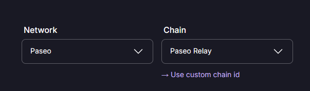
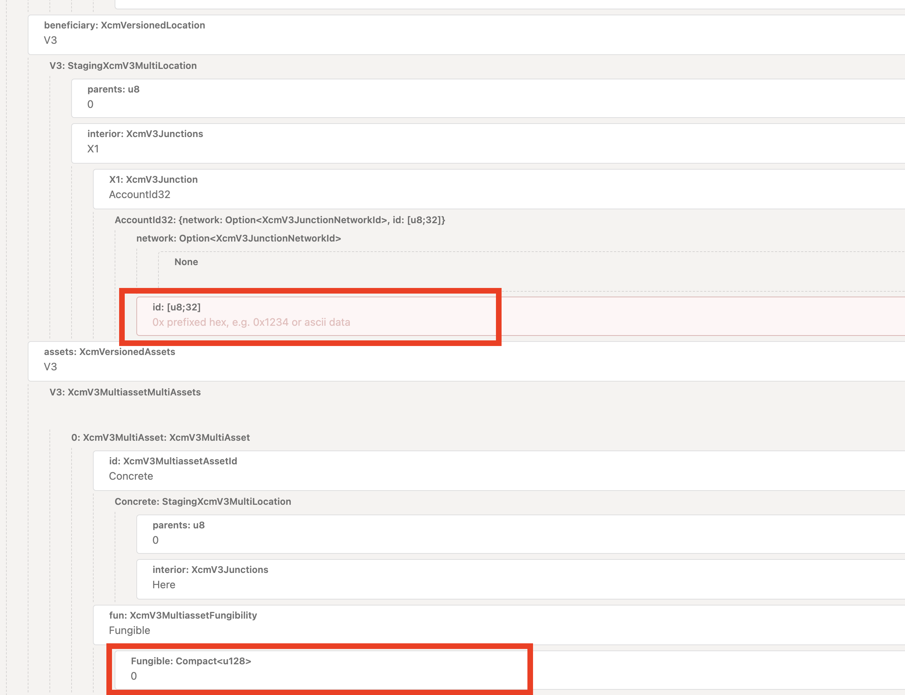

## 1. Use The Paseo Faucet

Go to the [Paseo Faucet](https://faucet.polkadot.io/) and request some PAS tokens. Make sure:
- "Network" is "Paseo"
- "Chain" is "Paseo Relay"



## 2. Bridge the Tokens to IDN

You need to reserve transfer the newly minted tokens from Paseo to IDN. For that you need to execute an XCM transaction on PASEO.

**1.** Go to the [Polkadot/Substrate Portal](https://polkadot.js.org/apps/) and select a Paseo RPC endpoint, then navigate to “Developer” → “Extrinsics” → “Decode” and paste this code:

```json
0x630203000100594603000101007369626cf21100000000000000000000000000000000000000000000000000000304000000000b005039278c0400000000
```

**2.**  Go to “Submission” and edit the beneficiary, and the amount to transfer
> One DOT is represented as 10_000_000_000, so remember to add 10 trailing 0’s to the number of tokens you want to transfer/



## 3. Submit the transaction

Once the transaction is executed and processed by IDN, your account should have the transferred amount (minus the XCM fees)
