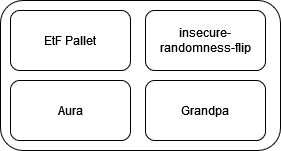

# EtF Network Overview and Architecture

ETF network is based on Aura consensus, a round-robin PoA (Proof of Authority) slot-based consensus mechanism. It utilizes DLEQ (Discrete Logarithm Equality) proofs to create BLS (Boneh-Lynn-Shacham) IBE (Identity-Based Encryption) block seals. Block importers verify the validity of the DLEQ proof when importing each block.

We also introduce the EtF pallet, which stores public parameters for the identity based encryption scheme. The pallet uses arkworks to ensure parameters stored in the runtime are decodable as valid group elements.

The AuraAPI has been enhanced to deliver IBE parameters and secret keys to both block proposers and block verifiers, facilitating a more efficient and secure block proposal and verification process.

## Pallets



## Encryption to the Future

Here we present a high-level overview of how EtF works. For a more in depth look, jump to the [math](./etf.md)

The initial version of the network uses a fork of Aura, a round-robin proof of authority consensus mechanism. Each authority knows the same secret, the IBE master secret which makes the identity based encryption scheme work (more on this [here]()). They are trusted to act as a secret key custodian (a requirement we will relax in the future).  When a slot author proposes a block, they first use the master secret to calculate a slot secret, which they add to the block header. This slot secret is intended to be **leaked** and made public. Next, in order to ensure the correctness of the secret to be leaked, block producers include a DLEQ proof that shows the slot secret was correctly calculated. Along with this, they also sign the block as usual. 

Block importers simply fetch the public IBE parameters from the EtF pallet and use it to verify the DLEQ proof. If the DLEQ proof is not valid, the block is rejected. 


### Slot Identity

We use a PoA consensus system in which a known set of authorities, say A = {A_1, …, A_n}, are selected as slot authors sequentially (round robin). That is, for a slot \\(sl_k\\), the authority to author a block in the slot is given by \\(A_{sl_k} = A[sl_k \mod |A|] \\). A slot’s identity is given by \\(ID_{sl_k} = A_{sl_k} || sl_k\\) where \\(||\\) is concatenation. That is, it’s the combination of the slot author’s public key and the slot id. For example, given the ss58 address `5GGrFp7o5b5CMSi9uZnkveRusegbVgVUa5BvqXRQHsJ9SSjc` (Alice), a slot identity might look like: `0xd43593c715fdd31c61141abd04a99fd6822c8558854ccde39a5684e7a56da27d231922012` 231922012 is the slot id and `0xd43593c715fdd31c61141abd04a99fd6822c8558854ccde39a5684e7a56da27d` is the public key of the ss58 address.

Our implementation works over curve BLS12-381. To get a public key from the slot id, we use a hash-to-G1 function, which gives us public keys in G1 (the elliptic curve group we’re working with). That is, each slot implicitly has an identity, and by evaluating the id under the hash-to-G1 function, a public key in G1. 

### ETF Pallet

The ETF pallet stores public parameters needed for the IBE scheme, a single public key in G1 as a compressed byte array. This value is set on genesis and only changeable by the root user (via the Sudo pallet) when they call the `update_ibe_params` extrinsic. The extrinsic uses Arkworks to decode the input to ensure that the provided data is a valid element of G1, and if so then it encodes it in storage. In the future, we intend to make this a more democratic process.

The aura client reads the public parameters from the runtime while preparing the DLEQ proof (when claiming a slot)

### Claiming a Slot

When a block author claims a slot, they perform the [extract algorithm of the IBE scheme](./etf.md#identity-based-encryption), where they use their slot public key along with the master secret to calculate the slot secret (e.g. d = sQ where s is the master secret and  is the public key). In order to do this, we introduce new functionality to the existing AuraAPI which allows slot authors to fetch the IBE public parameters, which are stored in the etf pallet, as well as read the master secret from local storage. 

After calculating the slot secret, the slot author is tasked with preparing a DLEQ proof that the slot secret was calculated from the master secret. We accomplish this by implementing a trait which enables DLEQ proof and verification, using Arkworks. It allows the prover to demonstrate that, given some xG and xH, that both were calculated from x without revealing the value.  In our scheme, one of the values is the slot secret, `d = sQ`, and the other is the master secret multiplied by the public param stored in the etf pallet. The DLEQ proof is then encoded within the block header when it is proposed by the author. That is, each block header contains a PreDigest which contains the slot id, the slot secret, and the DLEQ proof like so:

``` rust
PreDigest: {
    slot: 'u64',
    secret: '[u8;48]',
    proof: '([u8;48], [u8;48], [u8;32], [u8;48])'
}
```

### Importing and Verifying Blocks

When a block importer receives a new block, they first check that the slot is correct. If correct, then they recover the DLEQ proof from the block header and verify it along with the block seal (which is still a normal Schnorr signature). If the DLEQ proof is valid, then we know the slot secret is valid as well. If the proof is invalid, then the secret is incorrect and the block is rejected.

### Consensus Error Types

Block producers and importers are given two new consensus error types [here](https://github.com/ideal-lab5/substrate/blob/502032949307b1c19cba606dbef1d2f108f71a56/primitives/consensus/common/src/error.rs#L53). For **block producers**, the `InvalidIBESecret` is called when the aura client cannot fetch a master IBE secret from local storage. For **block importers**, `InvalidDLEQProof` is triggered when a DLEQ proof cannot be verified. This is very similar in functionality to the `BadSignature` error type.

### Authority Incentives

Since we have a proof of authority network, authority incentives are very simple.
1. When a new session starts, [each authority recieves 10 tokens](https://github.com/ideal-lab5/substrate/blob/cf0a5193af80e458ee585a614f7ff12ece9b56fd/frame/aura/src/lib.rs#L269)
2. If an authority produces a bad block, it will be rejected by importers and the authority will be unable to author more blocks (this isn't completely implemented yet).