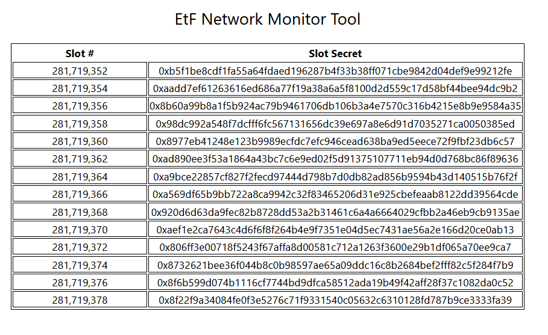

# Etf Monitor

The etf monitor is a simple React app to monitor the etf network. Presently, it simply subscribes to incoming blocks and decodes the headers, displaying slot ids and slot secrets as new blocks are imported. At present, it is hardcoded to connect to a node's RPC on localhost:9944. This can be modified by updating the code and rebuilding. Enhancements will be coming soon.

## Overview

Essentially, it simply decodes the predigest of each incoming slot header, which stores the slot id, secret, and DLEQ proof, and displays them in a table. 

``` javascript 
PreDigest: {
    slot: 'u64',
    secret: '[u8;48]',
    proof: '([u8;48], [u8;48], [u8;32], [u8;48])'
}
```



## Setup

``` bash 
git clone git@github.com:ideal-lab5/etf-monitor.git
cd etf-monitor
npm i && npm run start
```
